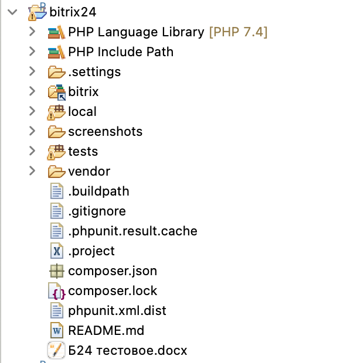
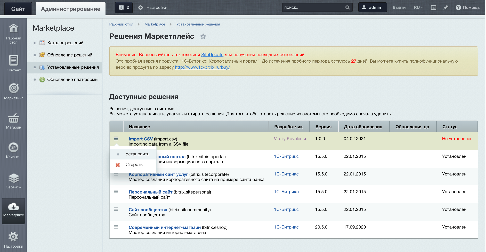
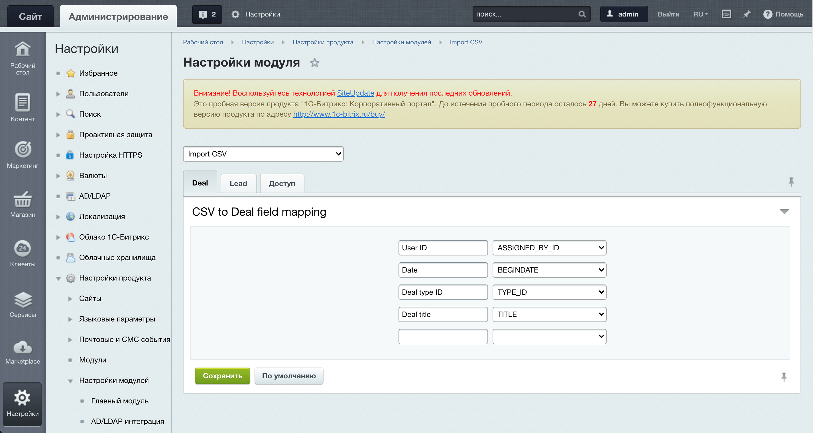
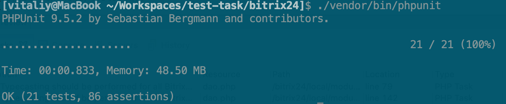
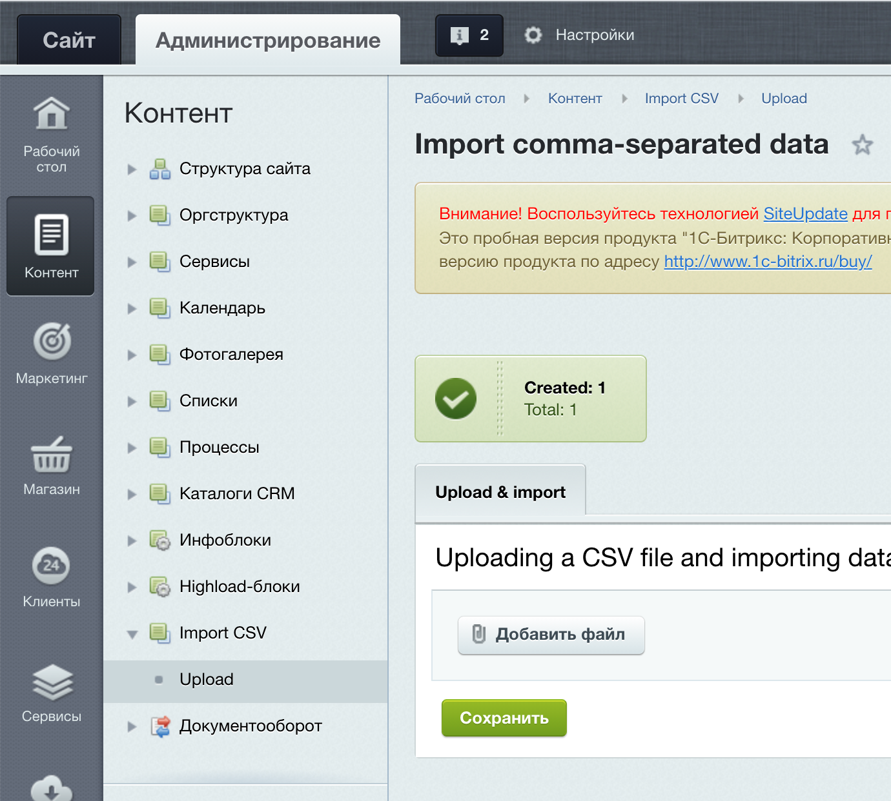
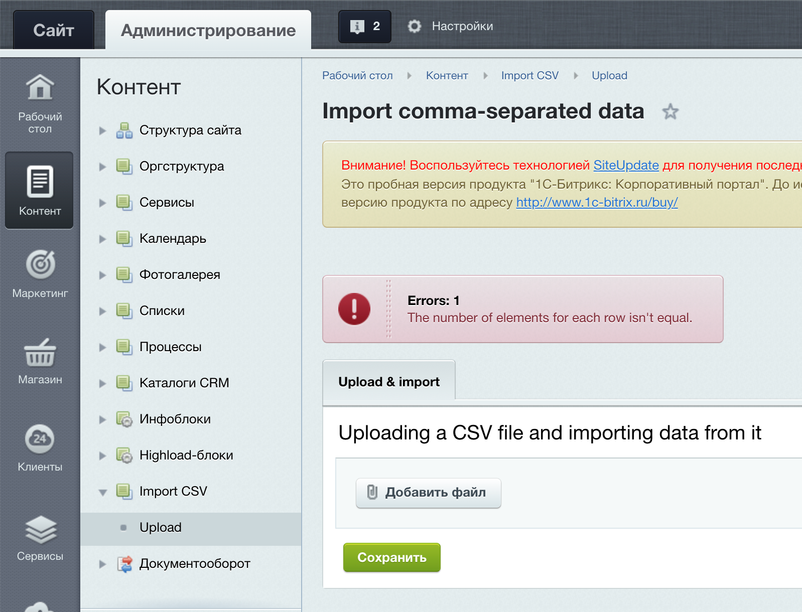

# Импорт сделок и лидов из CSV файла

## Решение

* Разработан модуль `import.csv`. Обеспечивает загрузку CSV файла в Административной панели и импорт его данных.
* Модуль поддерживает настройки доступа взависимости от групп пользователей. По умолчанию только супер-администратор имеет право на доступ.
* После установки для обеспечиния работоспособности модуля необходимо в его настройках указать сопоставления колонок CSV и полей сделок/лидов.
* Проект покрыт модульными и интеграционными тестами.

### Недоработки

* Отсутствуют возможности удаления и добавления сопостановлений в форме настройки модуля. Для удаления можно использовать кнопку "По умолчанию", что приведет к сбросу всех настроек и сопоставновления придется вводить заново.
* Преобразование строковых значений дат в формат приемлемый Битриксом реализовано не в полной мере (захардкожен русский формат d.m.Y). Предполагается создание отдельного класса для обработки данной логики.
* Валидация полей сохраняемых объектов возлагается на фреймворк. (Собственно, так и должно быть, но не достаточно было протестированно.)
* Отсутствует локализация.

## Установка

* `git clone https://github.com/orm-backend/bitrix24.git`
* `cd bitrix24`
* `composer install` (Только для запуска тестов)
* `ln -sv /path/to/your_bitrix_site/bitrix` Создает ссылку на дистрибутив Битрис вашего сайта (каталог bitrix).
* `cd /path/to/your_bitrix_site/` Переход в корневой каталог вашего сайта.
* `mkdir -p local/modules` Создает необходимые директории при их отсутствии.
* `ln -sv /path/to/bitrix24/local/modules/import.csv local/modules` Создает ссылку на модуль в каталоге modules вашего сайта.
* Войдите на сайт в Административную панель как супер-администратор и установите модуль (см. скриншот).

## Настройка

* Войдите на сайт в Административную панель как супер-администратор.
* Задайте соответствия колонок CSV (первая строка) и полей сущности Сделка.
* Задайте соответствия колонок CSV (первая строка) и полей сущности Лид.
* При необходимости раздайте права на доступ к модулю.

## Тестирование

* Предполагается:
    * Дистрибутив Битрикса установлен
    * В нем установлен модуль CRM
    * Сайт настроен и запущен
    * Соединение с базой данных установлено
* `./vendor/bin/phpunit` Запуск тестов

## Запуск

* Войдите на сайт в Административную панель как супер-администратор.
* Перейдите на страницу модуля (см. скриншот).
* Загрузите файл. (Файл можно взять в каталоге tests/resources проекта).

